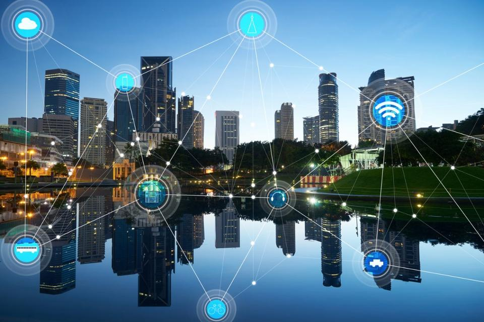

# IoT Development

# Table Of Contents
- [What IoT](#what-is-Iot)
- [Application of IoT](#application-of-iot)

- [Table Of Contents](#table-of-contents)
- [Sources](#sources)
  - [Books / Documentation](#books--documentation)
  - [Videos](#videos)
  - [MISC](#misc)

## What is IoT 

IoT stands for **I**nternet **O**f **T**hings. IoT refers to billions of physical devices around the world that are connected to the internet collecting, sharing and analyzing data. Thanks to cheap processors and wireless networks, it's possible to turn anything, from a pill to an aeroplane to a self-driving car into part of the IoT
 
The Internet Of Things is a network of physical devices (Things) that are embedded with sensors, actuators, software and other electronics over the internet through IP connectivity to integrate the physical world into our digital systems, Providing efficiency improvements and economical benefits.

## Application of IoT
IoT is one the key factors of Fourth Industrial Revolution. 
The [IEEE](https://www.ieee.org/) has compiled data and makes the following claims about its current and future impact:
- In 2015, the global wearables market had already increased 223% from the previous year (and data on Statista shows it increasing by another 243% between 2015 and 2022)
- By 2020, 250 million vehicles will be connected to the Internet
- IoT will add 15 trillion dollars to the global economy over the next 20 years
- There will be 50 billion Internet-connected devices by the year 2020.
### IoT Verticals
- Manufacturing
- Smart City
- Smart Building
- Healthcare
- Energy
- Transportation and Smart Vehicles
- Logistics and Inventory Management
- Retail
- Agriculture
- Military

## Technology Stack for IoT
The IoT stack is rapidly developing and maturing into the Thing Stack. This Thing Stack consists of three technology layers: sensors, microcontrollers and internet connectivity, and service platforms.
- **Layer One** - Sensors are embedded in objects (Things) or the physical environment to capture information and events from our environment, like a temperature sensor.

- **Layer Two** - Microcontrollers and internet connectivity share information captured by sensors within your IoT objects and act based on this information to change the environment, like smart AC maintaining the temperature of the room.

- **Layer Three** - Through the aggregation and analysis of data, service platforms cater to your customers. Service platforms also control your IoT product's end-to-end experience and enable your customers to define system rules and update the firmware.

Source : [THE INTERNET OF THINGS (IOT) TECH STACK EXPLAINED](https://www.cognitiveclouds.com/insights/the-internet-of-things-iot-tech-stack-explained/#:~:text=The%20IoT%20stack%20is%20rapidly,internet%20connectivity%2C%20and%20service%20platforms.)

# Courses 
- [An Introduction to Programming the IOT Specialization](https://www.coursera.org/specializations/iot) - Coursera
- [Internet of Things and AI Specialist](https://www.piaic.org/iot) - PIAIC 

## Books / Documentation

## Videos
[Internet of Things - How it works](https://www.youtube.com/watch?v=QSIPNhOiMoE&feature=emb_title)

## MISC
